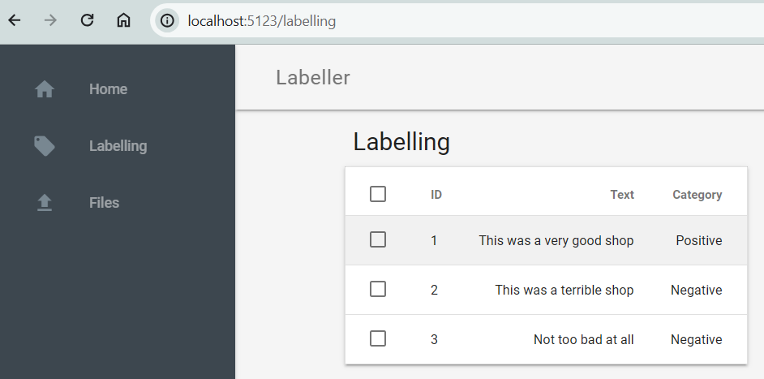

# Basic labelling app for Machine Learning project

Still work in progress.

## Testing out a framework for labelling

Starting with Googles Material Design Lite, Python Flask and SQLite

```sh
python -m venv ~/venv/flask-labelling
source ~/venv/flask-labelling/bin/activate
```

```sh
python app.py
```

[http://127.0.0.1/home](http://127.0.0.1/home)

```log
 * Serving Flask app 'app'
 * Debug mode: on
WARNING: This is a development server. Do not use it in a production deployment. Use a production WSGI server instead.
 * Running on all addresses (0.0.0.0)
 * Running on http://127.0.0.1:5123
Press CTRL+C to quit
 * Restarting with stat
 * Debugger is active!
 * Debugger PIN: 863-760-531
127.0.0.1 - - [07/Jun/2024 11:22:45] "GET / HTTP/1.1" 404 -
127.0.0.1 - - [07/Jun/2024 11:22:48] "GET /home HTTP/1.1" 200 -
```

Example of a screen sourcing data from the SQLite DB.


